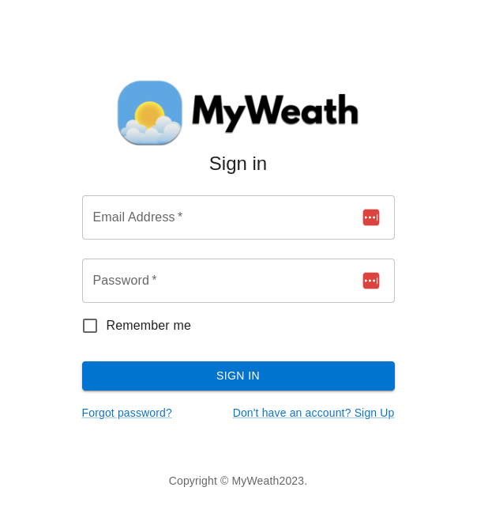

**Project name**: Weather App

**Team members**: Muhammad Awais (528057), Martin Bartos (506502)

**Repository url**: <url>

**Deploy url**:  <url>
 
**Seminar group**:  02, 01

The projet will be a weather app that displays current and upcoming weather conditions for any location. Users can search by name or ZIP code, and view details such as temperature, humidity, and more. The app could also allow users to search for historic weather data by selecting a specific date.

# WiP - actual state
## Sign in page
